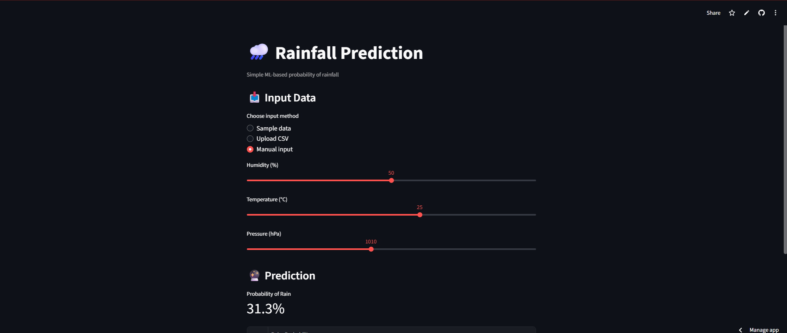

# 🌧️ Australian Rainfall Prediction App

A lightweight, production-ready machine learning application that predicts the **probability of rainfall** based on weather conditions.

## 🚀 Live Demo
👉 https://australian-weather-rainfall-prediction-fc6qyskgzoawwzlkddg22w.streamlit.app/

## 🧠 Project Overview
This project demonstrates an end-to-end ML workflow:
- Data preprocessing
- Model inference
- Feature schema enforcement
- Interactive prediction via a clean UI

The dashboard is intentionally minimal to emphasize **reliability, clarity, and deployability**.

## 🛠️ Tech Stack
- Python
- pandas, numpy
- scikit-learn
- Streamlit
- joblib

## 📥 Input Options
- Sample dataset (built-in)
- CSV upload
- Manual single-record input

## 📤 Output
- Probability of rainfall
- Downloadable predictions (CSV)

## 📦 Model
- Random Forest Classifier
- Trained offline and loaded as a serialized artifact

## 📌 Key Design Decisions
- Feature schema saved and enforced at inference
- Deterministic preprocessing
- Minimal UI to reduce deployment risk

## 📸 Screenshots

## 👤 Author
Shivam Tiwari
